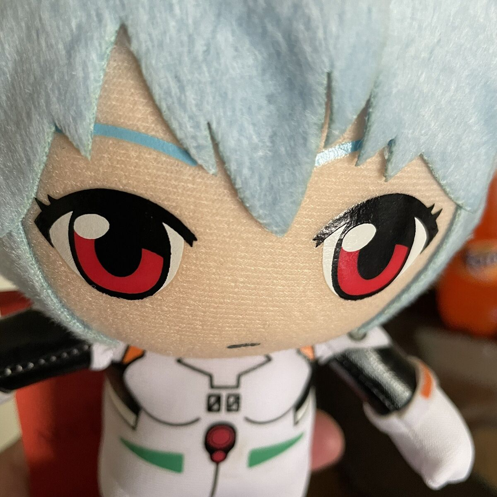

<h1>👋 Hey, I’m Carlos Vásquez!</h1>

I’m a Full-Stack Developer passionate about building full-stack apps, currently working with Vue/Nuxt on the frontend and Flask/FastAPI on the backend. I'm always tinkering with new ideas, learning through building, and freelancing along the way.

I believe deeply in open source and love contributing when I can — whether that’s code, support, or just sharing what I’ve learned. Always down to collaborate, experiment, or debug something tricky.

Let’s connect: carlosevasquez2024@gmail.com

 

✨ Creating bugs since 2022 📚 I'm currently learning Nuxt/Vue.js + FastAPI

###

 
<h2>I code with</h2>

  
  
  
  
  
  
  
  
  
  
  
  
  
  
  
  
  

